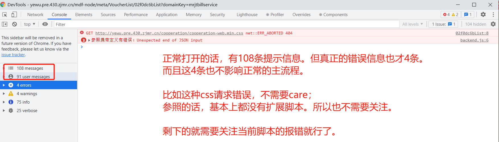

## 1.查看当前页面的字段、属性、值等

首先，鼠标放在你想查看字段的位置，然后右键 or f12打开

基本在在element附近，你就能看到你选中字段的 name，value等值了。

如果这个看不出来的话，可以通过脚本的方式来查看。切换到console面板，

输入 yya.getAllData();

如果想获取单个字段的值，可以通过 yya.getData('field')的方式获取。

具体api可以后面细讲，有兴趣的也可以自行研究。

## 2.console面板错误信息太多

其实可以选择过滤。

console面板的信息分info(消息)、verbose(长消息)、error(错误)、warning(警告)四个等级。

我们一般只需要关注error就好了。其他的不影响主程序，所以基本上可以忽略。

除非前端专业调试或者需要提高性能等方面才需要去关注其他等级的提醒。

## 3.查看当前页面对应的js文件

从设计器上复制这个页面的单据号，然后打开source面板，快捷键 ctrl+p，黏贴页面单据号回车即可。

一般来说，扩展脚本的格式都是  引擎应用名称+单据号+VM.Extend.js;所以看到类似于这样的脚本，就选中双击就好了。

然后根据你想要去调试的问题先搜索下，搜索不到的话看下注释，一般来说都有对应的中文注释在里面。

实在不知道怎么查看，那就先在init方法的第一行打上断点，或者多打几个断点。

然后刷新下页面，一行一行的跟，就大概知道这个页面怎么个运行流程了。

可能会涉及到一些模块引用的问题，这个时候直接鼠标悬浮在上面就好了。

——

## 4.解释js的精度问题

见bug 24163

现象： 0.1+0.2 == 0.3  //false;

300-295.1410 =4.859    //false;

原因：计算机在进行计算的时候，都是先转为二进制的。而浮点型的二进制表示的时候是无穷的，IEEE754标准中用64位（第一位是符号位，11位来表示指数，52位表示尾数）表示的话会截断后面的位数，再转化为十进制，就很有问题了。

前端能存的最大位整数是Math.pow(2,53) =9007199254740991 （16位）。但是如果后台利用雪花算法自动生成id的话，就会超过这个位数了，所以这种自增id最好使用字符串转给前端。不然精度丢失就容易出问题。

结论：尽量不要在前端进行数值计算，如果一定要计算，那就做好精度匹配（比如乘以10000或者多少，然后再除以10000）。

不然很容易出问题（要么就使用其他办法，可能会影响一定性能。比如转为bigInt类型）

## 5.解释为啥不能本地调试

—主要是后台无法本地运行

之前我们是一个应用引擎对应一个前端工程的，后台也是如此。

后面我们说分散的话，对于前端来说