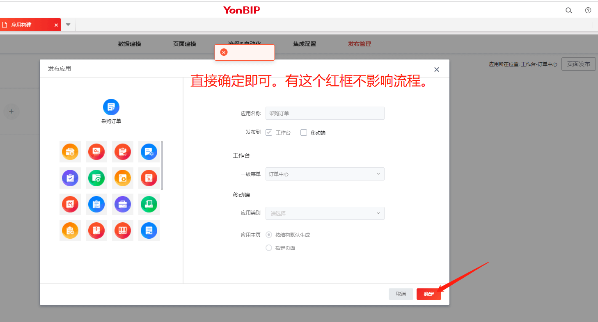
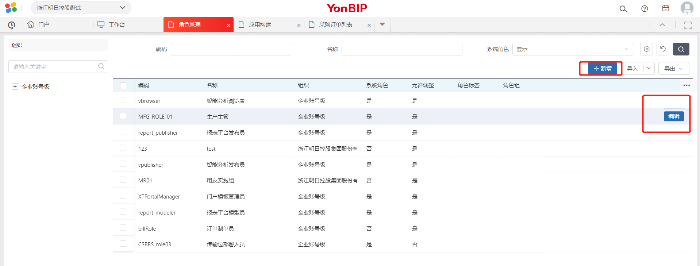

## 按钮权限配置

1. 先从设计器中拖拽出按钮，修改按钮的显示名称。（如果有事件，前端需要在代码中实现）

2. 再点发布应用（因为现在大部分应用都是发布过的，所以需要重新发布一遍.。不然是看不到该按钮的。）

   

   

3. 从侧边栏【数字化建模】—权限管理—角色管理；选中某个角色之后，点编辑。然后可以在页面里勾选你新加的按钮。

   

**常见问题：**

- 新增了按钮看不到？

  重新发布下应用。然后刷新下页面；

- 不知道员工对应的角色？

  在授权菜单里面，找到对应的员工，然后选择分配角色，里面就有他已分配的角色。

- 删掉了按钮，如何处理？

  重新发布下应用，所有角色权限中都会删掉该关系。

## 前端打包发包流程

**git地址：**[dev-430-plus](http://gitlab.mrkg.vip/erp-yonyou-group/erp-iuap5.0/mrjt-iuap5-fe/-/tree/dev-430-plus)

1. 从git上clone对应的分支。现在是dev-430-plus是对应预发和测试环境；（一般只有预发和测试才需要线下打包）
2. 线上地址是 online-430-plus；（直接执行流水线）
3. 先git status 查看当前分支状态，尽量保证和git库一致。（如果不一致的话 git pull等各种操作下）
4. 然后点击build.sh，运行bash命令（该文件需要运行在git客户端环境里面 [git客户端下载地址](https://git-scm.com/downloads) )
5. 运行完之后，可以在（mrjt-iuap5-fe\static\mrjt-extends）目录下看到打包好的各个模块。
6. 然后选中所有模块文件夹，现在是有5个模块，少了或者多了都要重新检查下。不能在外层选中打包，流水线那边对文件层级做了严格要求。
7. 打包成zip格式的压缩包，即可。（我优化了下打包流程，可以自动压缩成zip，并增加了时间戳后缀名。一般包的大小为32M左右，大于或者小于这个大小太多的都不正常，重新回到第一步进行检查。）
8. 登录技术中心，使用管理员账号，找到extends项目，预发环境 or 测试环境。然后编辑—上传应用包，完成配置。然后点击部署即可。

**常见问题**

- 部署后怎么验证上传的包成功了？

  可以在network里面查看extends.js对应的版本号，如果版本号和之前的有变动，那说明更新成功了。

- 如果再build.sh的时候报错了，应该是缺少依赖包。新增了个filemanger-webpack-plugin，需要重新install下。

## 菜单发布

切换成管理员账号登录（在wiki上找到管理员账户和密码），登录后，先在应用构建里面打开应用构建

然后找到要发布菜单对应的引擎和服务

发布好之后，管理员是可以在自己账户下看到该菜单的。（如果没看到肯定是配置有问题了）

如果管理员是可以看得到的，说明发布成功。

## 新增角色

如果这个菜单需要一个新的角色来维护的话，那就需要新建一个角色，并且给他配置菜单权限

打开角色管理之后，根据需要进行新增，或者直接选择现有的角色进行菜单权限分配。

到这里的话，角色的权限就配置完成了

## 给用户分配角色，或者给角色分配用户

现在需要把用户和角色关联起来，打开权限管理-授权页面

分配完角色，用户重新登录即可看到菜单。

## 全员授权

## 新增打印模板

打印模板现在都是由用友实施方配置的。

后期如果业务有新需求的话，我们这边也可能需要配置下。

在应用构建—页面建模—打印模板上新增

PS：也可以在侧边栏上数字化建模—模板管理—打印模板上统筹管理。

新增好打印模板后，一般都需要通过前端写代码来获取该打印模板的code。（这一步比较复杂，需要前端来实现。）

然后把printCode和bizDomainCode塞进去，就可以生成对应的模板pdf了。

PS：还可以通过设计器上，拖拽按钮出来的时候，更改这几个属性即可进行合同打印。

要记得先在正式环境上配置好。（怕各个环境的code会不一致）

##  常规配置

### 1.部门和公司的区分

在设计器里面配置查询条件

相关bug：23150，22820

但是是否末级部门这个又需要放在代码里面配置。

公司-参照配置-增加过滤条件-是否业务单元=1；

部门-参照配置-增加过滤条件-是否业务单元=0；

部门-多选取值。可以在设计器上配置。

### 2.员工的配置

在设计器里面员工参照，涉及到创建人、修改人、员工、业务员等字段。

相关bug：23020，22606

PS：如果是有externaData的查询条件，需要先让前端在代码里面清空掉。（之前加上，是因为要显示主职部门即可，因为有一个人对应多个部门。后面通过员工参照底层解决掉了这个问题。）

### 3.查询条件是空的、或者没有配置参照

相关bug：22698，22544

需要重新拖一遍。这种问题之前出现原因是导库的时候，有脏数据导致的。

### 4.如何发布应用和菜单

相关bug：22592

1. 我们需要发布我们的应用。（在应用构建上直接发布就好了）
2. 一般来说，我们直接发布的时候，选择好对应的一级菜单，后面就会自动给你创建好服务、应用、菜单等。重新登录后可以在侧边栏上看到你新建的菜单。
3. 但是如果我们一级目录想用个新的，那我们就需要在菜单管理一级导航目录上新建一个目录。然后再点发布的时候，选择这个一级目录。
4. 或者说你想更改侧边栏的文字显示，也可以直接在菜单管理上更改配置。

服务配置地址就是这个，替换下单据List和domainKey就可以了。

$HPAPAAS_HOST/meta/VoucherList/02f0dc6bList?domainKey=mrjtbillservice

一定要多看几遍，不能有空格和其他乱七八糟符号！！！

### 5.字段名称设置，最好不好超过6个字，不然就像这样，很难显示的下。

相关bug：21626

- 这个点暂时没有很好的解决办法。并不是说技术上有难度，而是在寻找一个平衡点。因为要考虑到视觉的统一性。

### 6.参照的模糊搜索

设计器配置，"bSmartSearch" : true ,

## 其他相关资料

 [新附件管理] https://www.yuque.com/docs/share/c5790874-1cd3-4444-bc77-1222f4ffc1b5

[查询区的语雀文档]https://www.yuque.com/docs/share/c57a03a1-a2a4-4637-8b21-33f0f31bc022?#

https://www.yuque.com/docs/share/e2cb62fc-48b6-49fc-899b-791e1577d023

[mdf文档](http://tinper.org/mdf/docs#/em1n71.html)

——下面这两个点可讲可不讲。

### 解释：审批流的id为什么需要增加这么多前缀和后缀

——后面统一调用接口，来确定是哪个审批流

相关bug：23222

### 后台规范：通过待办打开的页面，如果有传参的话，需要注意下，iframe不会重新刷新数据。所以后面查询数据最好使用post接口。

demo见之前的待办签章，重新选另一条数据无法覆盖，会有问题。

后面改了后台传参方式就好了。

根本问题是通过待办打开的是iframe框架，而至于为什么框架选择iframe，暂时不太清楚。