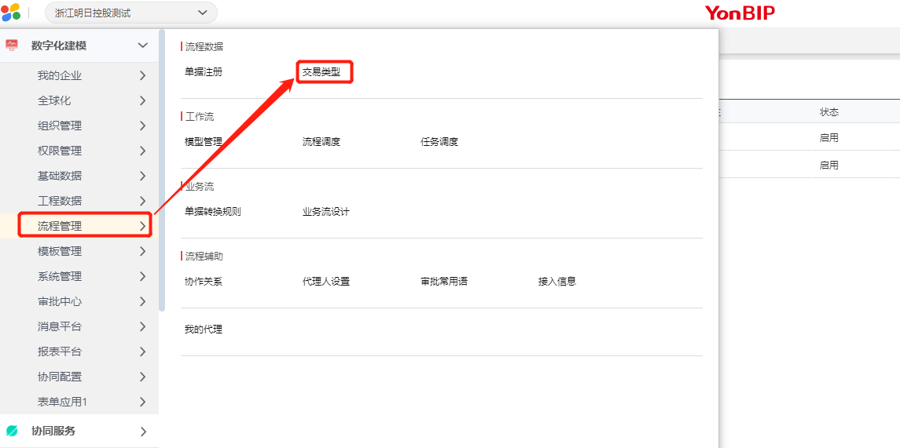
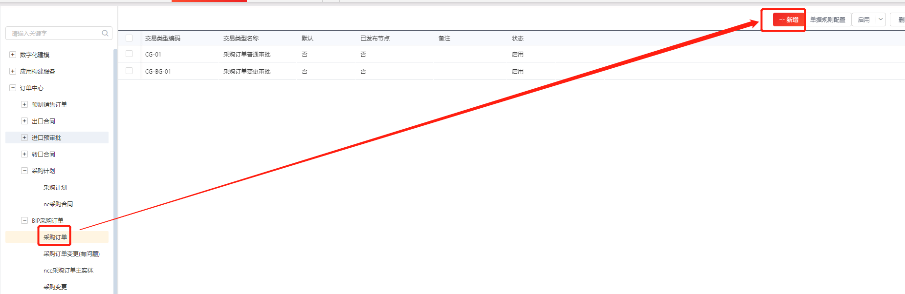
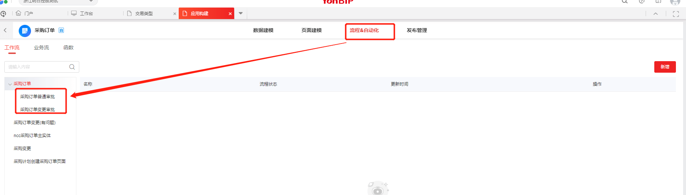
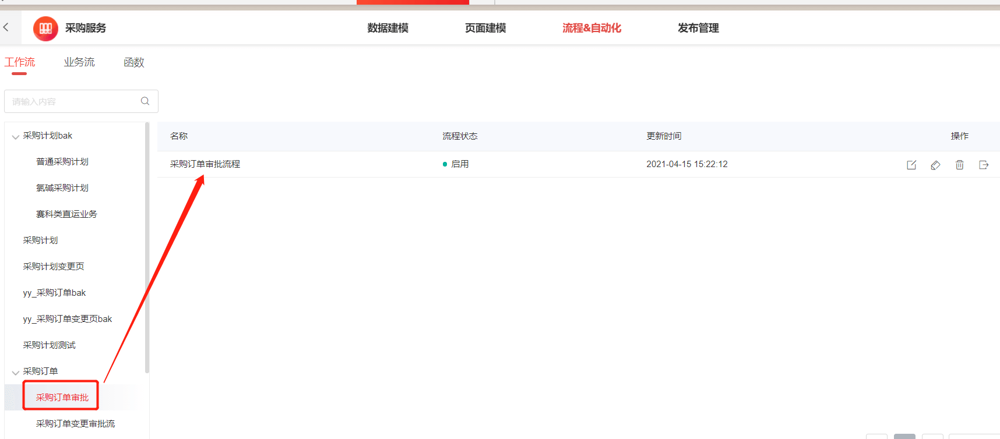
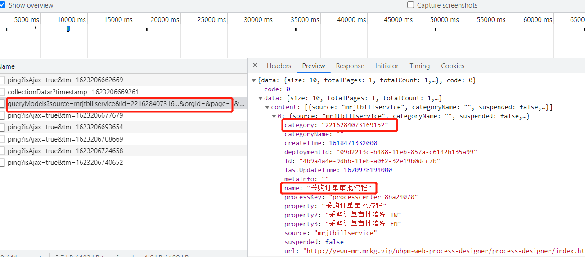

## 多条审批流配置

打开数字化建模，需要的审批流上配置对应的交易类型规则，新增好之后保存。






回到应用构建上来，在对应的菜单下会自动新增两条交易类型规则，在对应的规则里面配置一下对应的审批流即可。




ps：在新增的时候，就要把该条记录的审批交易规则id放进去。不然会找不到定义的审批流。

在前端代码里面配置：（该审批流id，可以在打开该审批流程的时候，f12查看）

```javascript
//参考采购订单变更的时候更改单据审批流
data.bustype='2216284073169152'
args.data.data=JSON.stringify(data);
return args; 

//或者参考采购计划，根据不同部门设置不同审批流的值
viewModel.get('bustype').setValue('2275985376071936');
viewModel.get('bustype_name').setValue('氯碱采购计划');
```






## 单条审批流配置

单条审批流配置，可直接在应用构建上构建，但只能构建一条，因为有多条的话，会报  多条流程未定义。

新增一条审批流即为默认审批流。


## 审批流配置技巧

1.尽量用角色代替某个确定的人。因为流程不可复用，所以初始化工作会比较庞大

2.单据就算有再多条审批流，也要在顶层配置一条默认的，防止单据流转的时候找不到对应的审批流。


## 需要改派

在当前节点勾选 改派即可。