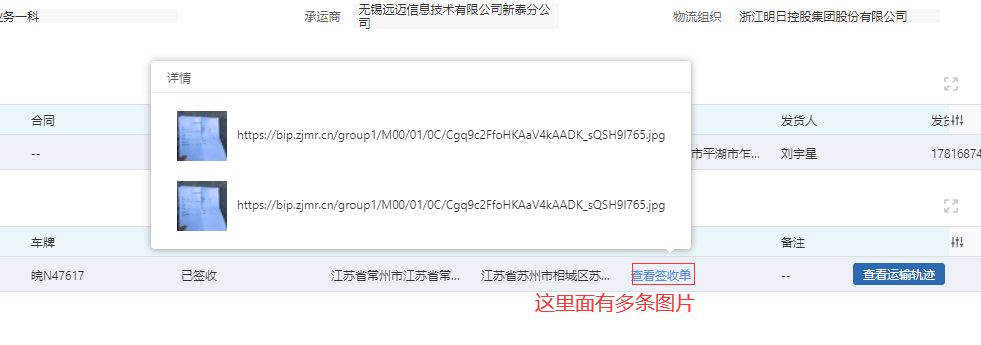
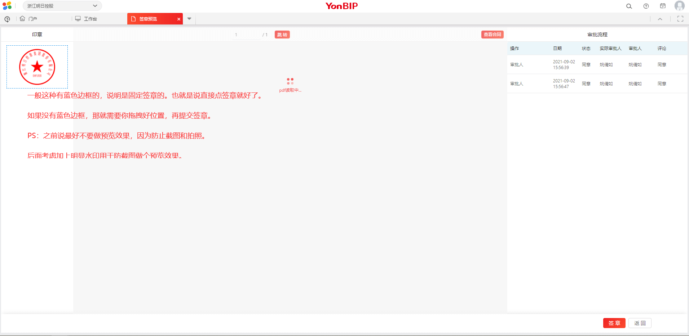
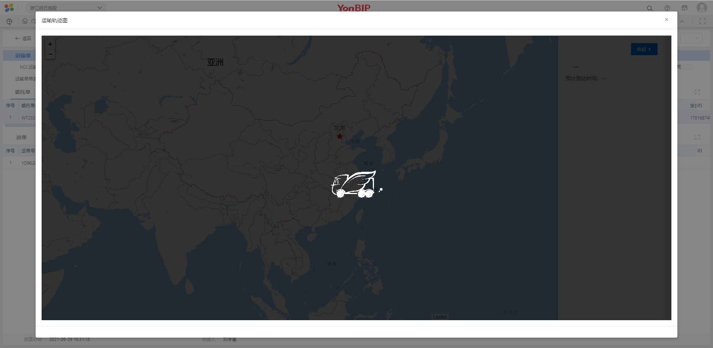

## 1.链接点击

在表格的单元格里面，可以实现多个点击链接（仅限于图片、文件,or链接）

来自物流中心的运输单列表上（预发环境）。

在表格上还可以实现多链接的跳转；具体实现案例在销售定的不执行数报表上。

相关bug： 24326

需要注意的点：

* 如果是多个链接，需要和前端沟通好格式。有些是逗号隔开的，有些可以设置为json格式。根据实际情况来，最好使用前端要求的字段和格式。

## 2.签章预览和拖拽

PS：签章模块的测试，不能使用ymanager账号。因为签章权限需要具体到实际用户身上，如果不是员工登录，就会报错。

 这块其实可以用前端玩出很多花样。因为是单独开的页面，所以不受限。

后面个性化页面也可以按照这样的模式开发。（当前前端开发成本可能较大）

## 3.弹窗打开第三方url

现应用在物流中心-运输单的运输轨迹里，如图：

大小和显示位置都可以调。

类似于弹窗的内容都可以自定义。

所以以后弹窗内的需求基本上都可实现。

## 4.自定义表格内容（不需要元数据）

采购订单的审批界面，协同和审批历史，这两个表格是通过接口查询出来的，和元数据无关。

前端协助完成表格组件，然后拖动一个表格设置类型 cControlType即可。

可以在该表格上完成很多事情。但也有个问题就是，手动新建的表格和其他自带的表格表头高度不一致什么的，所以这就需要前端遵守统一底层ui库，不能一会使用这个ant库，一会使用tinper，或者yong-ui就会视觉上很不统一。

后期考虑下，删除无用的组件，以及统一一下底层ui库。

## 5.

