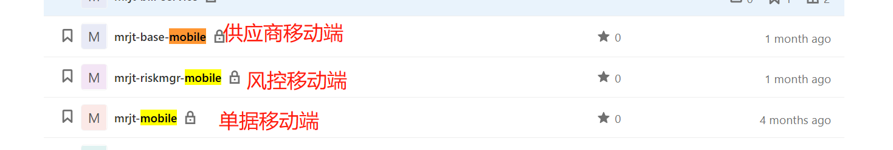

# 准备工作

- mobile项目工程，git地址

clone下来之后，一般使用拷贝方式安装npm_module，不然有些内部mdf包，在没有vpn的情况下是很难安装上的。

一般分支有pre，test，master（正式），对应各个环境的代码。

- npm run debug:mobile   本地启动 之后，可以调样式或者组件；

打开移动端页面的预览，然后点击微信扫一扫，出来的链接就是可以更改的链接url了。直接使用域名：

http://mobile.pre.430.zjmr.cn/mrjt-bill-mobile/view/YYArchive/4fa2577dMobileArchive?tenantId=brliz47i&s=1&terminalType=3&mode=add&domainKey=mrjtbillservice

把http://mobile.pre.430.zjmr.cn/mrjt-bill-mobile 替换成http://test.zjmr.cn:3003/ 即可

http://test.zjmr.cn:3003/view/YYArchive/4fa2577dMobileArchive?tenantId=brliz47i&s=1&terminalType=3&mode=add&domainKey=mrjtbillservice

## 1.如何利用安卓机调试

- 安卓机安装apk包     https://www.pgyer.com/esn-android-b   密码：123
- 安装好之后，登录。最好使用测试人员账号，审批中心数据多一点。需要切换明日测试空间
- 在数据线连接之前，先设置好开发者模式，每个机器设置不太一样。也要确定数据线是否有数据传输功能，不能只是充电的数据线。
- 还需要在开发者选项中，打开USB选项调试，不然谷歌监控不到设备
- 连接调试模式，然后可以打开对应的页面，在谷歌上输入 [chrome://inspect/#devices](chrome://inspect/#devices)
- 查看devices里面的信息，需要翻墙

常见问题博客：

- https://blog.csdn.net/byc233518/article/details/52437498

## 2.如何在pc端调试

可以把下面的url替换下yht_access_token和页面单据billno即可。

yht_access_token在你登录过之后的application里面，找到替换即可。

http://mobile.pre.430.zjmr.cn/mrjt-bill-mobile/view/yyarchive/4fa2577dMobileArchive?terminalType=3&domainKey=mrjtbillservice&mode=browse&_id=11112499434460221696&approveid=11112499434460221696.2499434465317120&yht_access_token=bttdjhtckpPMXkvb1RtQkVXMWpjdlNnbzNSS1JjR0E1YjBFRE9pZU5UelVJaHhHWHJGLzdRc3RIUkdqM2tZYllNd0dud2MrdFp0aTFFMWdXbW13UUNPMjJnd015NlZKam5zaFErUXZUQXlPOVl0SFg1Sm5BMnIrT0M5cVZwSDBpOURfX3lld3UucHJlLjQzMC56am1yLmNu__ba4bcd1070d2d84f790ca1e78f2c0b32_1635989513018&isApprove=true

同样的，需要在本地联调的话，把http://mobile.pre.430.zjmr.cn/mrjt-bill-mobile 替换成http://test.zjmr.cn:3003/ 即可

mobile.pre.430.zjmr.cn/mrjt-bill-mobile/view/yyarchive/4fa2577dMobileArchive?terminalType=3&domainKey=mrjtbillservice&mode=browse&_id=11112510730490564864&approveid=11112510730490564864.2510730492530944&yht_access_token=bttdCtRWDh2NDJvcThSTnkyZ2U3V2tEM2VYZmhwTkJISmU3WTJacXpoYlFZUGs4b1U1NDdwN2NZUjZpN3JSeDdDdDQ1Y1A5dlZVWG9BZUVEaFhkN292NkNLdGxvYmRnMzF3SEdzVS9FQUtFcVE9X195ZXd1LnByZS40MzAuemptci5jbg..__ba4bcd1070d2d84f790ca1e78f2c0b32_1636437301835&isApprove=true

http://test.zjmr.cn:3003/view/yylist/7cba653aMobileBlank?terminalType=3&domainKey=mrjtbillservice&pk_supplier=0JtNYAPGFEy0GjtZHFuN

http://mobile.pre.430.zjmr.cn/mrjt-bill-mobile/componentLib/index.js

## 移动端开发注意事项

- 如果是按钮，要可以点击，需要加上属性："cBrowseClick": true,
- 基本上页面不满足需求的话，就需要单独写组件实现了
- 如何获取url上的参数？一般wm.getParames无效，需要使用window.location.search;
- 如果要快速定位问题的话，一般只能通过设计器里面写代码。后面可以尝试使用override，根据webpack打包出来的资源加载替换掉。
- fetch的post请求，参数放body里面，并且只能放qs格式化

## 开发自定义组件

一般需求都要求自定义实现，那在移动端如何开发新组建。

语雀文档

https://mtldev.yuque.com/books/share/62974f02-6c04-4ebb-8f4a-52daac29ac53/xxinye

组件一般放在 mrjt-riskmgr-mobile这个项目里面，所以需要把组件代码同步过去。

## 打包上传资源包

打包命令：

npm run build:mobile:yonbip

然后上传资源包，和pc一致

## 问题

-  mrjt-riskmgr-mobile 和mobile这几个项目的区别是什么？
- 是不是以后组件开发需要每个都要复制一下？（或者考虑吧组件放到一个公共项目中，后面就引入这个打包出来的js就好了）
- 

