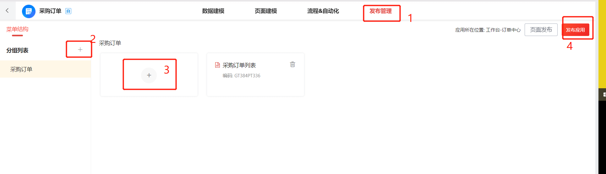
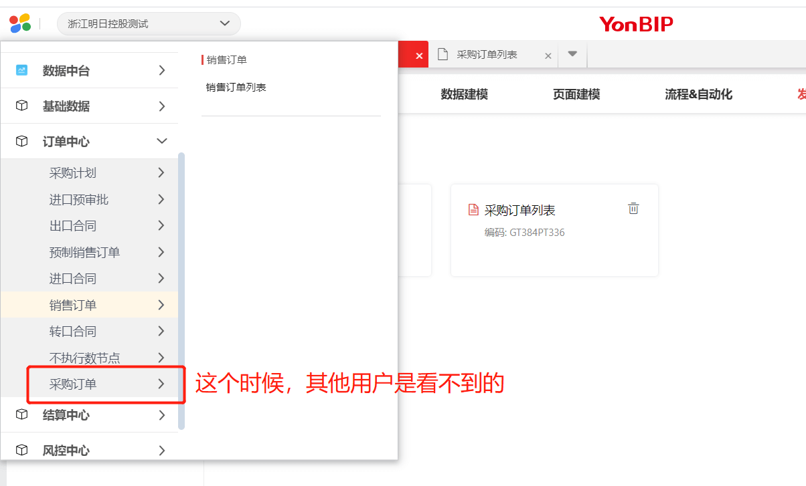
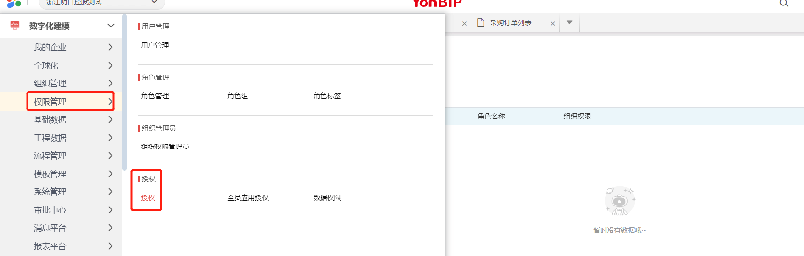
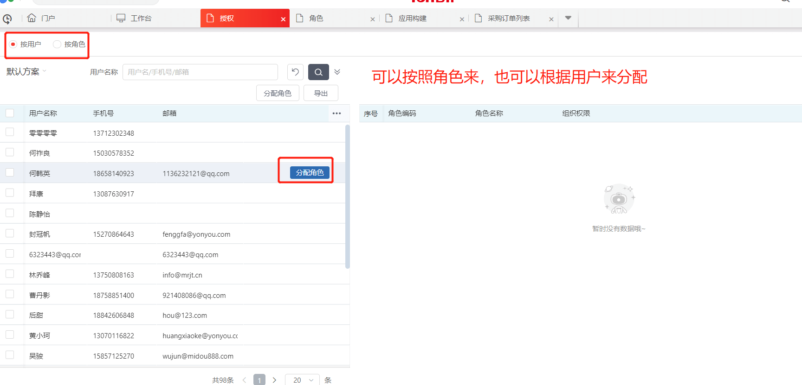

## 菜单发布

切换成管理员账号登录（在wiki上找到管理员账户和密码），登录后，先在应用构建里面打开应用构建

然后找到要发布菜单对应的引擎和服务

发布好之后，管理员是可以在自己账户下看到该菜单的。（如果没看到肯定是配置有问题了）

如果管理员是可以看得到的，说明发布成功。

## 新增角色

如果这个菜单需要一个新的角色来维护的话，那就需要新建一个角色，并且给他配置菜单权限

打开角色管理之后，根据需要进行新增，或者直接选择现有的角色进行菜单权限分配。

到这里的话，角色的权限就配置完成了

## 给用户分配角色，或者给角色分配用户

现在需要把用户和角色关联起来，打开权限管理-授权页面

分配完角色，用户重新登录即可看到菜单。

## 全员授权

以上。

